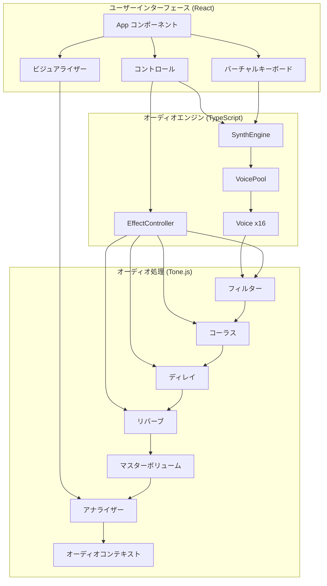
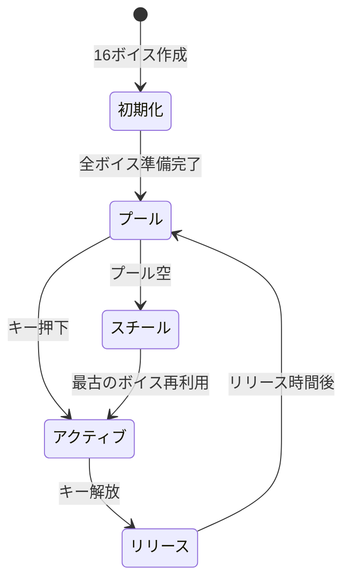

# Musako - 高機能ウェブシンセサイザー

React、TypeScript、Tone.jsで構築された高性能ポリフォニックシンセサイザー。高度なボイス管理とリアルタイムオーディオ処理を実現。

## 🎹 主な機能

- **16ボイス同時発音**（インテリジェントボイススチーリング搭載）
- **ボイスプール管理**によるゼロレイテンシーのノートトリガー
- **多彩なオシレーター波形**: サイン波、矩形波、ノコギリ波、三角波
- **高度なADSRエンベロープ**コントロール
- **マルチモードフィルター**: ローパス、ハイパス、バンドパス、ノッチ
- **プロフェッショナルエフェクトチェーン**: コーラス、ディレイ、リバーブ
- **リアルタイム波形表示**
- **バーチャルピアノキーボード**（タッチ対応）
- **コンピューターキーボードマッピング**によるライブ演奏

## 🏗️ アーキテクチャ

### システム概要



### ボイスプール管理

最適なパフォーマンスのための高度なボイスプールシステム：



### 主要コンポーネント

#### 1. **SynthEngine** (`src/synth/SynthEngine.ts`)
- オーディオコンテキストとエフェクトチェーンの管理
- ノートトリガーとボイス割り当ての処理
- UIとオーディオ処理の調整

#### 2. **VoicePool** (`src/synth/VoicePool.ts`)
- 16個のシンセサイザーボイスを事前割り当て
- ボイススチーリングアルゴリズムの実装
- ゼロレイテンシーのノートトリガーを保証

#### 3. **Voice** (`src/synth/Voice.ts`)
- Tone.Synthを使用した個別のシンセサイザーボイス
- 設定可能なオシレーターとエンベロープ
- 効率的なパラメーター更新

#### 4. **EffectController** (`src/effects/EffectController.ts`)
- オーディオエフェクトチェーンの管理
- リアルタイムパラメーター制御
- 適切な信号ルーティング

## 🚀 パフォーマンス最適化

1. **ボイスの事前割り当て**: 16個すべてのボイスを初期化時に作成
2. **単一オーディオコンテキスト**: Tone.start()は一度だけ呼び出し
3. **効率的なボイススチーリング**: プールが満杯時は最古のボイスを再利用
4. **最適化されたReactレンダリング**: Context APIによる状態管理
5. **TypeScript型安全性**: コンパイル時エラーチェック

## 🛠️ 技術スタック

- **React 18** - フックを使用したUIフレームワーク
- **TypeScript 5** - 型安全な開発
- **Tone.js 14** - Web Audio合成
- **Vite 5** - 高速ビルドツールと開発サーバー
- **Context API** - 状態管理

## 📁 プロジェクト構造

```
src/
├── components/     # Reactコンポーネント
│   └── App.tsx    # メインアプリケーションコンポーネント
├── contexts/      # Reactコンテキスト
│   └── SynthContext.tsx
├── effects/       # オーディオエフェクト
│   ├── EffectController.ts
│   └── index.ts
├── synth/         # シンセサイザーコア
│   ├── SynthEngine.ts
│   ├── VoicePool.ts
│   ├── Voice.ts
│   └── index.ts
├── types/         # TypeScript定義
│   └── index.ts
├── ui/            # UIコンポーネント
│   ├── Controls.ts
│   ├── VirtualKeyboard.ts
│   ├── Visualizer.ts
│   └── index.ts
├── utils/         # ユーティリティ
│   └── constants.ts
├── styles/        # CSSスタイル
│   └── index.css
└── main.tsx       # アプリケーションエントリー
```

## 🎮 はじめに

### 必要環境

- Node.js 16以上とnpm
- Web Audio API対応のモダンウェブブラウザ

### インストール

```bash
# リポジトリをクローン
git clone https://github.com/HatakeyamaOsamu/musako.git
cd musako

# 依存関係をインストール
npm install
```

### 開発

```bash
# 開発サーバーを起動
npm run dev

# 型チェック
npm run type-check

# プロダクションビルド
npm run build

# プロダクションビルドのプレビュー
npm run preview
```

## 🎹 使用ガイド

### キーボードマッピング

```
ピアノレイアウト:
  黒鍵:  S D   G H J   2 3   5 6 7
白鍵: Z X C V B N M Q W E R T Y U I

音階:
C3  C#3 D3  D#3 E3  F3  F#3 G3  G#3 A3  A#3 B3  C4  C#4 D4  D#4 E4  F4  F#4 G4  G#4 A4  A#4 B4  C5
```

### シンセシスパラメーター

#### オシレーター
- **波形**: サイン波、矩形波、ノコギリ波、三角波
- **同時発音数**: 最大16ボイス

#### エンベロープ (ADSR)
- **アタック**: 0.01秒 - 2秒
- **ディケイ**: 0.01秒 - 2秒
- **サステイン**: 0% - 100%
- **リリース**: 0.01秒 - 5秒

#### フィルター
- **タイプ**: ローパス、ハイパス、バンドパス、ノッチ
- **カットオフ**: 20Hz - 20kHz
- **レゾナンス (Q)**: 0.1 - 30

#### エフェクト
- **コーラス**: レート、デプス、ミックス
- **ディレイ**: タイム、フィードバック、ミックス
- **リバーブ**: サイズ、ダンピング、ミックス

## 🔧 高度な設定

### ボイス数のカスタマイズ

`src/utils/constants.ts`を編集:

```typescript
export const MAX_VOICES = 16; // 同時発音数の上限を調整
```

### 新しい波形の追加

`src/types/index.ts`でオシレータータイプを拡張:

```typescript
export type OscillatorType = 'sine' | 'square' | 'sawtooth' | 'triangle' | 'custom';
```

## 🤝 コントリビューション

1. リポジトリをフォーク
2. フィーチャーブランチを作成 (`git checkout -b feature/amazing-feature`)
3. 変更をコミット (`git commit -m 'Add amazing feature'`)
4. ブランチにプッシュ (`git push origin feature/amazing-feature`)
5. プルリクエストを作成

## 📝 ライセンス

MITライセンス - 詳細は[LICENSE](LICENSE)を参照

## 🙏 謝辞

- [Tone.js](https://tonejs.github.io/) - 素晴らしいWeb Audioフレームワーク
- [React](https://react.dev/) - UIフレームワーク
- [Vite](https://vitejs.dev/) - 超高速ビルドツール

---

♪ [HatakeyamaOsamu](https://github.com/HatakeyamaOsamu)により作成