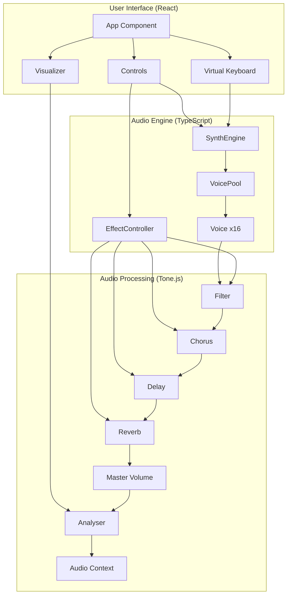
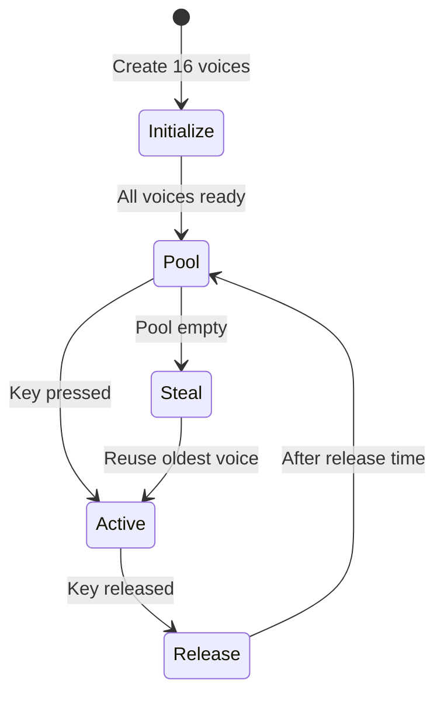

# Musako - Advanced Web Synthesizer

A high-performance polyphonic synthesizer built with React, TypeScript, and Tone.js, featuring advanced voice management and real-time audio processing.

## 🎹 Features

- **16-voice polyphony** with intelligent voice stealing
- **Voice pool management** for zero-latency note triggering
- **Multiple oscillator waveforms**: Sine, Square, Sawtooth, Triangle
- **Advanced ADSR envelope** control
- **Multi-mode filter**: Lowpass, Highpass, Bandpass, Notch
- **Professional effects chain**: Chorus, Delay, Reverb
- **Real-time waveform visualization**
- **Virtual piano keyboard** with touch support
- **Computer keyboard mapping** for live performance

## 🏗️ Architecture

### System Overview



### Voice Pool Management

The synthesizer uses an advanced voice pool system for optimal performance:



### Key Components

#### 1. **SynthEngine** (`src/synth/SynthEngine.ts`)
- Manages the audio context and effect chain
- Handles note triggering and voice allocation
- Coordinates between UI and audio processing

#### 2. **VoicePool** (`src/synth/VoicePool.ts`)
- Pre-allocates 16 synthesizer voices
- Implements voice stealing algorithm
- Ensures zero-latency note triggering

#### 3. **Voice** (`src/synth/Voice.ts`)
- Individual synthesizer voice with Tone.Synth
- Configurable oscillator and envelope
- Efficient parameter updates

#### 4. **EffectController** (`src/effects/EffectController.ts`)
- Manages the audio effects chain
- Real-time parameter control
- Proper signal routing

## 🚀 Performance Optimizations

1. **Voice Pre-allocation**: All 16 voices are created at initialization
2. **Single Audio Context**: Tone.start() is called only once
3. **Efficient Voice Stealing**: Oldest voices are reused when pool is full
4. **Optimized React Rendering**: Context API for state management
5. **TypeScript Type Safety**: Compile-time error checking

## 🛠️ Tech Stack

- **React 18** - UI framework with hooks
- **TypeScript 5** - Type-safe development
- **Tone.js 14** - Web Audio synthesis
- **Vite 5** - Fast build tool and dev server
- **Context API** - State management

## 📁 Project Structure

```
src/
├── components/     # React components
│   └── App.tsx    # Main application component
├── contexts/      # React contexts
│   └── SynthContext.tsx
├── effects/       # Audio effects
│   ├── EffectController.ts
│   └── index.ts
├── synth/         # Synthesizer core
│   ├── SynthEngine.ts
│   ├── VoicePool.ts
│   ├── Voice.ts
│   └── index.ts
├── types/         # TypeScript definitions
│   └── index.ts
├── ui/            # UI components
│   ├── Controls.ts
│   ├── VirtualKeyboard.ts
│   ├── Visualizer.ts
│   └── index.ts
├── utils/         # Utilities
│   └── constants.ts
├── styles/        # CSS styles
│   └── index.css
└── main.tsx       # Application entry
```

## 🎮 Getting Started

### Prerequisites

- Node.js 16+ and npm
- Modern web browser with Web Audio API support

### Installation

```bash
# Clone the repository
git clone https://github.com/HatakeyamaOsamu/musako.git
cd musako

# Install dependencies
npm install
```

### Development

```bash
# Start development server
npm run dev

# Type checking
npm run type-check

# Build for production
npm run build

# Preview production build
npm run preview
```

## 🎹 Usage Guide

### Keyboard Mapping

```
Piano Layout:
  Black Keys:  S D   G H J   2 3   5 6 7
White Keys: Z X C V B N M Q W E R T Y U I

Notes:
C3  C#3 D3  D#3 E3  F3  F#3 G3  G#3 A3  A#3 B3  C4  C#4 D4  D#4 E4  F4  F#4 G4  G#4 A4  A#4 B4  C5
```

### Synthesis Parameters

#### Oscillator
- **Waveforms**: Sine, Square, Sawtooth, Triangle
- **Polyphony**: Up to 16 simultaneous voices

#### Envelope (ADSR)
- **Attack**: 0.01s - 2s
- **Decay**: 0.01s - 2s
- **Sustain**: 0% - 100%
- **Release**: 0.01s - 5s

#### Filter
- **Types**: Lowpass, Highpass, Bandpass, Notch
- **Cutoff**: 20Hz - 20kHz
- **Resonance (Q)**: 0.1 - 30

#### Effects
- **Chorus**: Rate, Depth, Mix
- **Delay**: Time, Feedback, Mix
- **Reverb**: Size, Dampening, Mix

## 🔧 Advanced Configuration

### Customizing Voice Count

Edit `src/utils/constants.ts`:

```typescript
export const MAX_VOICES = 16; // Adjust polyphony limit
```

### Adding New Waveforms

Extend the oscillator types in `src/types/index.ts`:

```typescript
export type OscillatorType = 'sine' | 'square' | 'sawtooth' | 'triangle' | 'custom';
```

## 🤝 Contributing

1. Fork the repository
2. Create a feature branch (`git checkout -b feature/amazing-feature`)
3. Commit your changes (`git commit -m 'Add amazing feature'`)
4. Push to the branch (`git push origin feature/amazing-feature`)
5. Open a Pull Request

## 📝 License

MIT License - see [LICENSE](LICENSE) for details

## 🙏 Acknowledgments

- [Tone.js](https://tonejs.github.io/) for the amazing Web Audio framework
- [React](https://react.dev/) for the UI framework
- [Vite](https://vitejs.dev/) for the blazing fast build tool

---

Made with ♪ by [HatakeyamaOsamu](https://github.com/HatakeyamaOsamu)